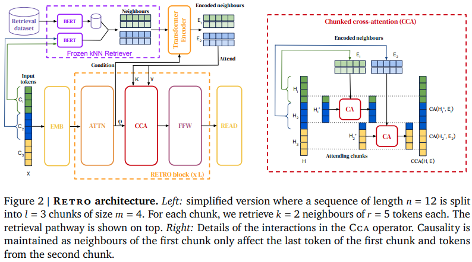

</img>

## Acknowledgements:
- [Dr. Phil Wang](https://github.com/lucidrains/)

## RETRO - Flax - (WIP)
Implementation of <a href="https://arxiv.org/abs/2112.04426">RETRO</a>, Deepmind's Retrieval based Attention net, in JAX Flax. This will deviate from the paper slightly, using rotary embeddings for relative positional encoding, as well as Faiss library instead of Scann.
